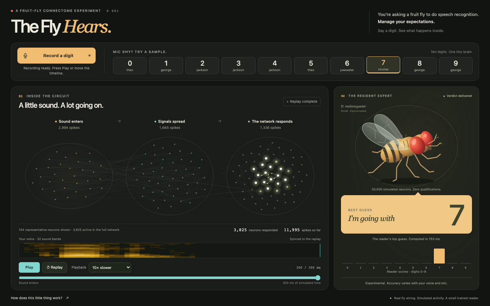

# The Fly Hears

**Say a digit. Watch your voice travel through a simulated fruit-fly brain.**

> You’re asking a fruit fly to do speech recognition. Manage your expectations.

A local experiment that sends spoken digits through **30,000 simulated neurons** connected using real fruit-fly wiring. Watch the recorded activity spread, slow it down, and see the trained reader’s best guess. The resident fly has red eyes, moving wings, and absolutely no qualifications.



[Run the demo](#run-the-demo) · [Results](#how-well-does-it-work) · [Train it yourself](docs/training.md) · [Model details](MODEL_CARD.md)

## What you can do

- Record one English digit, **0–9**, or try one of the ten included recordings.
- Watch actual recorded spikes on a schematic of connections from the selected fly network.
- Pause, scrub, and replay at 10×, 20×, or 40× slower than simulation time.
- See the prediction beside the animation, with a fly that reacts to recording and replay.
- Listen back to your microphone recording or save the exact WAV sent for prediction.

Everything runs on your computer after setup. No API key, cloud model, or GPU is needed.

## Run the demo

Use **Python 3.12** and [uv](https://docs.astral.sh/uv/getting-started/installation/). Clone or download this repository, open its directory in a terminal, then run:

```bash
uv sync --locked
uv run python -m scripts.setup_demo
uv run python -m app.server --run artifacts/demo --port 8001
```

Open **[localhost:8001](http://localhost:8001)**. Allow microphone access, say one digit, and follow the lights. Recording stops after two seconds; you can stop it earlier. The answer appears when the replay finishes. Move the timeline to the end to reveal it immediately.

The repository includes a roughly **6 MB demo bundle**: graph, reader, benchmark, and ten recordings. Setup checks its SHA-256 hashes and code compatibility, then copies the graph to `data/auditory.npz`. It refuses to replace a different graph. It does not download the full connectome or run training.

Tested locally on macOS with Python 3.12. The interface uses plain HTML, CSS, and JavaScript; Node.js is only needed for the frontend tests.

## What is actually learning?

```text
Your recording → 32 sound bands → simulated fly circuit → trained reader → digit
                                      fixed wiring         learns labels
```

The sound is measured in 32 frequency bands. An engineered mapping uses those measurements to stimulate simulated sensory neurons. Activity then spreads through **1,348,769 signed connections** taken from the selected MaleCNS network.

The fly wiring stays fixed. Training teaches a small logistic-regression reader to recognize digit labels from the resulting activity. This approach is called reservoir computing. It is a speech-classification experiment built around biological wiring; it does not establish that a living fly understands numbers.

The fly illustration is a mascot. The neuron layout is a schematic, while its flashes come from the same simulation used to make the prediction. A 300 ms replay shows compressed audio processing, not real-time biological hearing.

## How well does it work?

The real and scrambled circuits are nearly tied. This run does not show a clear advantage for the biological wiring. Only one scrambled graph was evaluated.

The saved `v2` experiment evaluates 3,000 recordings from six speakers. Each speaker is tested using a reader trained on the other five.

| Model | Clean recordings | Synthetic background noise |
|---|---:|---:|
| Fly wiring + reader | 70.0% | 68.2% |
| Scrambled wiring + reader | 69.7% | 70.0% |
| Audio features + reader | 66.9% | 67.8% |

[Raw results, per-speaker scores, and confusion matrices](artifacts/demo/results.json) · [Evaluation protocol](MODEL_CARD.md#evaluation)

A few things to expect:

- **Your microphone matters.** Volume, background sound, placement, and microphone processing can change the prediction. Artificial noise is not a benchmark of your laptop mic or earphones.
- **Silence can be rejected, but the speech check is imperfect.** Quiet speech may be rejected; some noises or non-digit words may still get a digit. The table measures the reader before that check.
- **The sample buttons are training examples.** They demonstrate the interaction, not performance on unseen voices. The final bundled reader was trained on all six speakers after evaluation.
- **Scores are not guarantees.** A high reader score can still accompany a wrong answer.

## Train it yourself

The [training guide](docs/training.md) covers the full dataset, activity generation, scrambled control, speaker-separated evaluation, and fresh microphone tests. It also explains how to rebuild the selected graph from the original connectome tables.

The recorded development run took about 15 minutes per graph for feature generation and 5.4 minutes for benchmarking and final reader training, excluding downloads and graph preparation. Your machine may differ.

## Check the code

```bash
uv run python -m unittest discover -s tests -v
node --test tests/replay.test.mjs
```

Use Node.js 22 or newer for the second command. Tests cover batch/live consistency, speaker isolation, noise handling, connection scrambling, artifact checks, sample URLs, and replay timing. They also run the ten bundled examples through the live prediction pipeline. A small synthetic experiment exercises training; tests do not launch the full training run.

## Project layout

| Path | What it contains |
|---|---|
| `app/` | Local web server, speech check, prediction, and animated interface |
| `scripts/encode.py` | Sound measurements and fixed sensory inputs |
| `scripts/fly_lif.py` | Frozen leaky integrate-and-fire simulation |
| `scripts/features.py`, `scripts/readout.py` | Shared activity features and trained reader |
| `scripts/simulate.py`, `scripts/train.py` | Feature generation and evaluation |
| `artifacts/demo/` | Small pretrained demo and checksums |
| `docs/`, `tests/` | Training instructions, provenance, and checks |

See [CONTRIBUTING.md](CONTRIBUTING.md) for development notes and [MODEL_CARD.md](MODEL_CARD.md) for the assumptions behind the model.

## Credits and licenses

To cite this software, use [CITATION.cff](CITATION.cff). Please also credit the underlying datasets and research relevant to your work:

- **Brain wiring:** [MaleCNS v1.0](https://male-cns.janelia.org/), from HHMI Janelia’s FlyEM team and collaborators at Cambridge, MRC LMB, and Google Research. [CC BY 4.0](https://creativecommons.org/licenses/by/4.0/).
- **Spoken digits:** [Free Spoken Digit Dataset](https://github.com/Jakobovski/free-spoken-digit-dataset), by Zohar Jackson and contributors. [CC BY-SA 4.0](https://creativecommons.org/licenses/by-sa/4.0/).
- **Neuron-model reference:** [Shiu et al., *A Drosophila computational brain model reveals sensorimotor processing* (2024)](https://doi.org/10.1038/s41586-024-07763-9).
- **Project and presentation inspiration:** [Jerry Liu’s fly_ocr](https://github.com/jerryjliu/fly_ocr).

Project code is [MIT licensed](LICENSE). Bundled data and model artifacts have separate terms, described in [THIRD_PARTY_NOTICES.md](THIRD_PARTY_NOTICES.md) and [the artifact notes](artifacts/demo/README.md). The upstream projects and researchers do not endorse this experiment.
